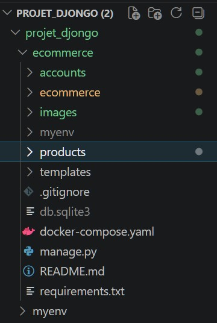
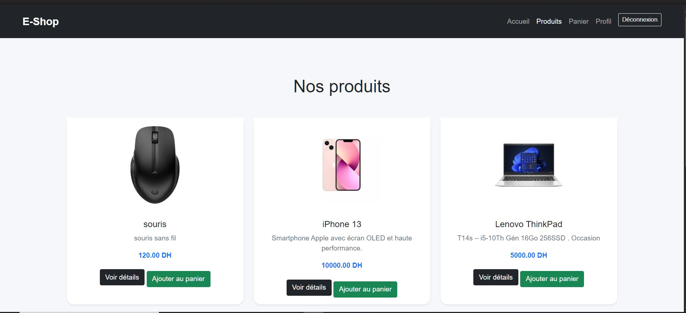
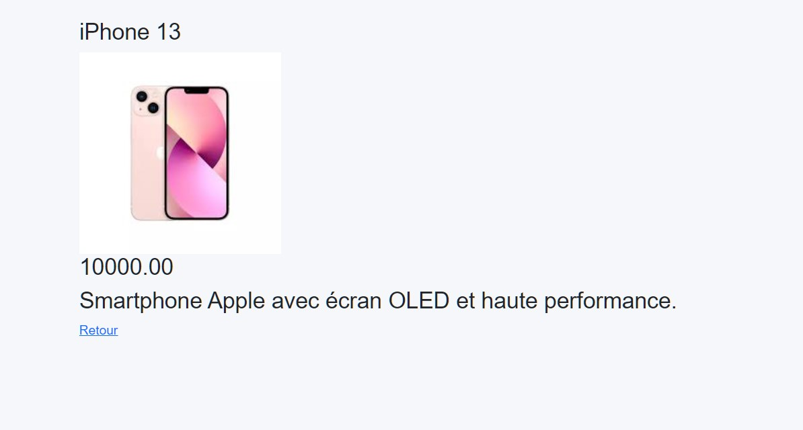
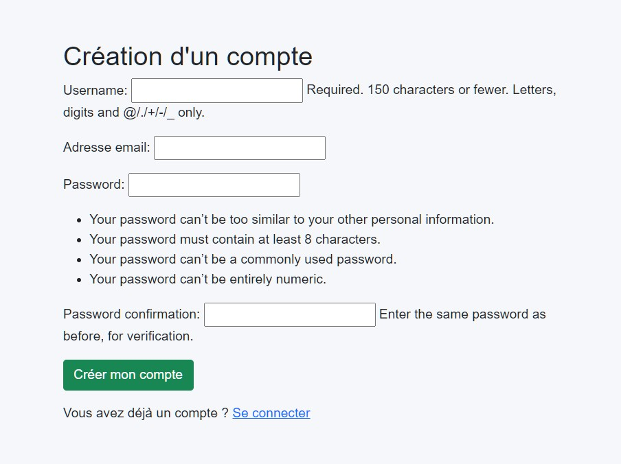
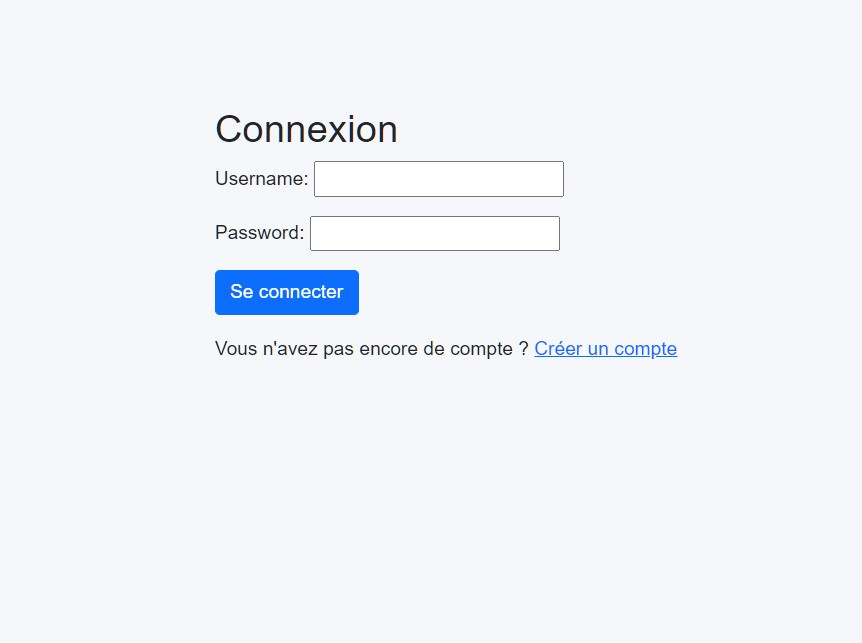
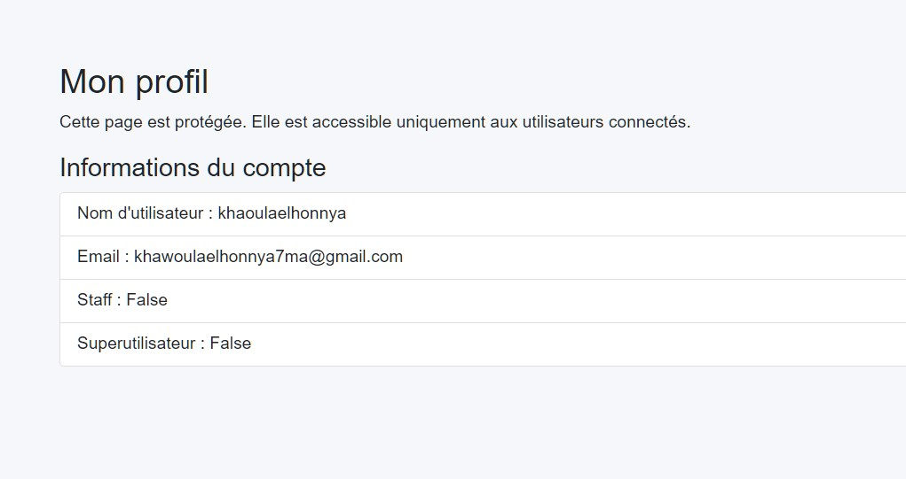
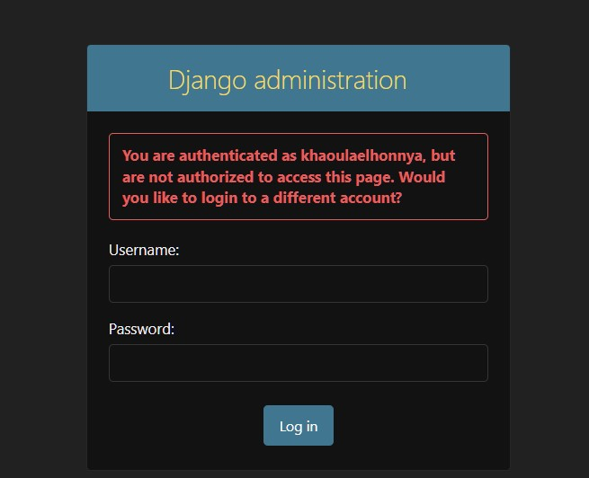
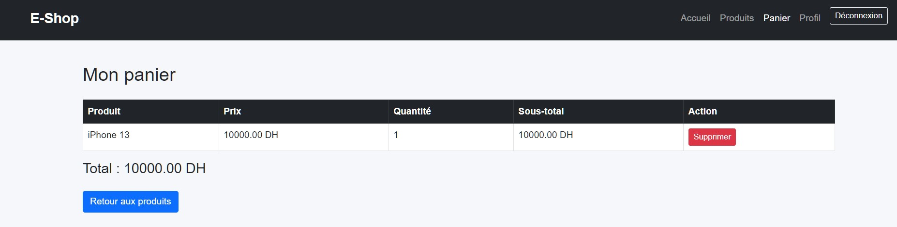
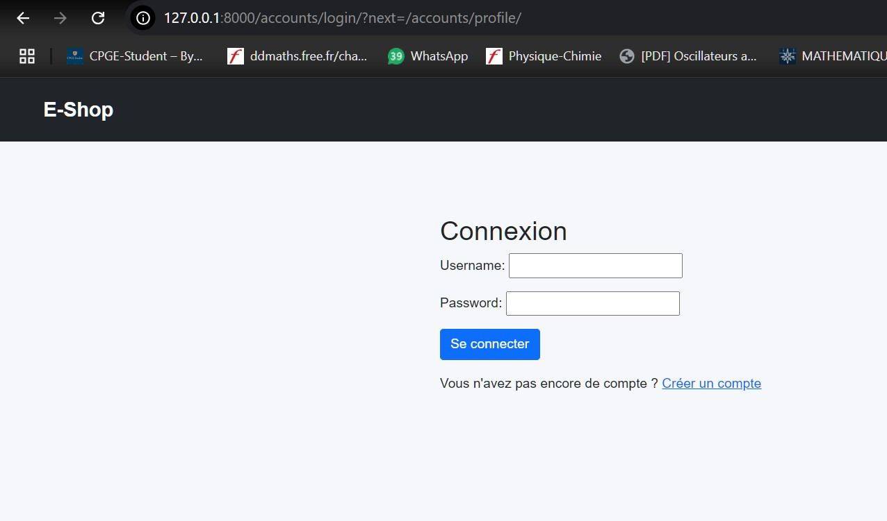
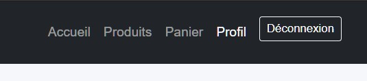

# Projet Django E-Commerce

Application web e-commerce développée avec Django dans le cadre des travaux pratiques.
Introduction

Ce projet a pour objectif de construire une application e-commerce complète permettant :
l’affichage des produits et catégories ;
la gestion des images ;
l’administration via Django Admin ;
l’authentification des utilisateurs ;
la protection des pages ;
la gestion d’un panier simple.
Technologies utilisées

Python
Django
SQLite
HTML / CSS
Bootstrap
Pillow
Structure du projet

ecommerce/
│── manage.py
│── db.sqlite3
│── README.md
│
├── ecommerce/
├── products/
├── accounts/
├── images/
├── templates/
└── screenshots/
# TP 2 : Gestion des données
Objectif

L’objectif de ce TP est de mettre en place la structure de base d’une application e-commerce avec Django en manipulant les modèles, la base de données et les vues.

Modélisation

Deux modèles principaux ont été créés :

Category

Le modèle Category représente les catégories des produits.

Exemples :

Téléphones
Informatique
Électronique
Product

Le modèle Product représente les produits vendus.

Chaque produit contient :

nom ;
description ;
prix ;
stock ;
image ;
catégorie.
Base de données

La base de données utilisée est SQLite. Elle est générée automatiquement dans le fichier :

db.sqlite3

Commandes utilisées :

python manage.py makemigrations
python manage.py migrate
Administration Django

L’interface admin permet d’ajouter, modifier et supprimer les produits, les catégories et les utilisateurs.

http://127.0.0.1:8000/admin/
# TP 3 : Authentification des utilisateurs
Objectif

L’objectif de ce TP est d’ajouter un système d’authentification permettant :

la création de comptes utilisateurs ;
la connexion ;
la déconnexion ;
la protection de certaines pages.
Création de l’application accounts

Une nouvelle application Django nommée accounts a été créée :

python manage.py startapp accounts

Elle a ensuite été ajoutée dans INSTALLED_APPS.

Formulaire d’inscription

Un fichier forms.py a été créé dans l’application accounts.

Il utilise UserCreationForm pour permettre la création d’un compte utilisateur avec :

nom d’utilisateur ;
email ;
mot de passe.
Pages créées
/accounts/signup/
/accounts/login/
/accounts/logout/
/accounts/profile/
Protection des pages

La page profil est protégée avec :

@login_required

Cela empêche un utilisateur non connecté d’accéder à la page profil.

# Panier
Objectif

L’objectif est d’ajouter une fonctionnalité panier simple à l’application e-commerce.

Fonctionnalités
ajouter un produit au panier ;
afficher le panier ;
supprimer un produit du panier ;
calculer le total.
Routes du panier
/products/cart/
/products/add-to-cart/<id>/
/products/remove-from-cart/<id>/
Captures d’écran
Architecture du projet

Cette capture montre l’organisation du projet Django avec les applications products, accounts, les templates, les images et la base de données.

Liste des produits

Cette page affiche les produits disponibles avec leurs images, prix et boutons d’action.

Détail d’un produit

Cette page affiche les informations détaillées d’un produit sélectionné.

Inscription

Cette page permet à un nouvel utilisateur de créer un compte.

Connexion

Cette page permet à un utilisateur existant de se connecter.

Profil utilisateur

Cette page affiche les informations de l’utilisateur connecté. Elle est protégée par login_required.

Interface admin

Cette interface permet de gérer les produits, les catégories et les utilisateurs.

Panier

Cette page affiche les produits ajoutés au panier, la quantité et le total.

Déconnexion

Après déconnexion, l’utilisateur est redirigé vers la page des produits.

Protection des pages

Lorsqu’un utilisateur non connecté tente d’accéder à /accounts/profile/, Django le redirige vers la page de connexion.

Exécution du projet
python manage.py runserver

Puis ouvrir :

http://127.0.0.1:8000/products/ 
## Captures d’écran

### Architecture du projet
Cette capture montre l’organisation du projet Django avec les applications products, accounts, les templates, les images et la base de données.

### Liste des produits
Cette page affiche les produits disponibles avec leurs images, prix et boutons d’action.

### Détail d’un produit
Cette page affiche les informations détaillées d’un produit sélectionné.

### Inscription
Cette page permet à un nouvel utilisateur de créer un compte.

### Connexion
Cette page permet à un utilisateur existant de se connecter.

### Profil utilisateur
Cette page affiche les informations de l’utilisateur connecté. Elle est protégée par login_required.

### Interface admin
Cette interface permet de gérer les produits, les catégories et les utilisateurs.

### Panier
Cette page affiche les produits ajoutés au panier, la quantité et le total.

### Déconnexion
Après déconnexion, l’utilisateur est redirigé vers la page des produits.

### Protection des pages
Lorsqu’un utilisateur non connecté tente d’accéder à /accounts/profile/, Django le redirige vers la page de connexion.

